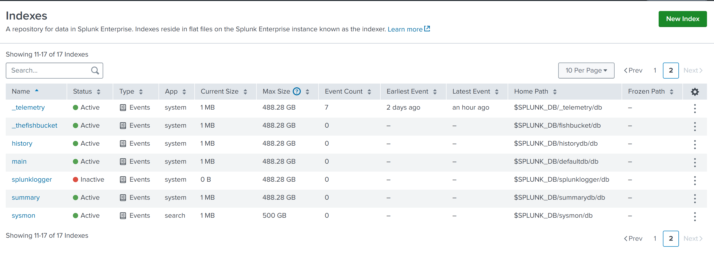

# 🛡️ Splunk SIEM Home Lab

A hands-on Security Information and Event Management (SIEM) lab built to simulate real-world SOC (Security Operations Center) environments. This project demonstrates endpoint telemetry collection, log forwarding, and centralized security monitoring using industry-standard tools.

---

## 📐 Architecture

```
┌─────────────────────────────┐         ┌──────────────────────────────┐
│       Windows Host          │         │       Ubuntu 22.04 VM         │
│   (Monitored Endpoint)      │         │   (VMware Workstation)        │
│                             │   TCP   │                              │
│  ┌─────────────────────┐    │  9997   │  ┌────────────────────────┐  │
│  │ Sysmon (EDR)        │    │ ──────► │  │ Splunk Enterprise      │  │
│  │ SwiftOnSecurity CFG │    │         │  │ 10.2.1                 │  │
│  └─────────────────────┘    │         │  │ Port 8000 (Web UI)     │  │
│           │                 │         │  │ Port 9997 (Receiver)   │  │
│           ▼                 │         │  └────────────────────────┘  │
│  ┌─────────────────────┐    │         │  IP: <SPLUNK-SERVER-IP>      │
│  │ Splunk Universal    │    │         └──────────────────────────────┘
│  │ Forwarder 10.2.1    │    │
│  └─────────────────────┘    │
└─────────────────────────────┘
```

---

## 🧰 Tools & Technologies

| Tool | Version | Purpose |
|------|---------|---------|
| Splunk Enterprise | 10.2.1 | SIEM — log ingestion, indexing, search |
| Splunk Universal Forwarder | 10.2.1 | Log shipping agent on Windows |
| Sysmon | Latest | Windows endpoint telemetry (EDR) |
| SwiftOnSecurity Sysmon Config | Latest | Industry-standard detection ruleset |
| VMware Workstation | 20.1 | Hypervisor for Ubuntu VM |
| Ubuntu 64-bit | 22.04 | Splunk Enterprise host OS |
| Windows 10/11 | Latest | Monitored endpoint |

---

## 🏗️ Infrastructure Setup

### Ubuntu VM Specifications
- **Disk:** 39GB
- **Network:** VMware NAT
- **Splunk Web UI:** `http://<SPLUNK-SERVER-IP>:8000`
- **Receiving Port:** 9997

### Windows Host
- **Role:** Monitored endpoint
- **Agents:** Sysmon64 + Splunk Universal Forwarder
- **Log Channel:** `Microsoft-Windows-Sysmon/Operational`

---

## ✅ Configuration Steps Completed

### 1. Splunk Enterprise (Ubuntu VM)
- [x] Installed Splunk Enterprise 10.2.1
- [x] Created `sysmon` index for dedicated log storage
- [x] Enabled receiving on port 9997
- [x] Configured firewall rules for port 9997

### 2. Sysmon (Windows Host)
- [x] Installed Sysmon64 with SwiftOnSecurity config
- [x] Verified event generation in `Microsoft-Windows-Sysmon/Operational`
- [x] Confirmed Event ID 1 (Process Create) logging

### 3. Splunk Universal Forwarder (Windows Host)
- [x] Installed Splunk Universal Forwarder 10.2.1
- [x] Configured `outputs.conf` pointing to Splunk server
- [x] Created `inputs.conf` for Sysmon event channel
- [x] Fixed service account permissions using `sc.exe`
- [x] Granted `NT SERVICE\SplunkForwarder` read access via `wevtutil`
- [x] Verified ESTABLISHED TCP connection via `netstat`

---

## 📁 Key Configuration Files

### inputs.conf
**Path:** `C:\Program Files\SplunkUniversalForwarder\etc\system\local\inputs.conf`
```ini
[WinEventLog://Microsoft-Windows-Sysmon/Operational]
index = sysmon
sourcetype = XmlWinEventLog:Microsoft-Windows-Sysmon/Operational
disabled = false
renderXml = true
```

### outputs.conf
**Path:** `C:\Program Files\SplunkUniversalForwarder\etc\system\local\outputs.conf`
```ini
[tcpout]
defaultGroup = default-autolb-group

[tcpout:default-autolb-group]
server = <SPLUNK-SERVER-IP>:9997

[tcpout-server://<SPLUNK-SERVER-IP>:9997]
```

---

## 🔍 Splunk Search Queries

### Basic Sysmon Search
```spl
index=sysmon
```

### Process Creation Events (Event ID 1)
```spl
index=sysmon EventCode=1
```

### Network Connection Events (Event ID 3)
```spl
index=sysmon EventCode=3
```

### Suspicious PowerShell Execution
```spl
index=sysmon EventCode=1 Image="*powershell.exe"
```

### File Creation Events (Event ID 11)
```spl
index=sysmon EventCode=11
```

---

## 🐛 Troubleshooting Log

| Problem | Cause | Fix |
|---------|-------|-----|
| 0 events in Splunk | `inputs.conf` missing | Created file using CMD echo command |
| Access denied on splunkd.log | Insufficient permissions | Used CMD as Administrator |
| Splunk restart failing | Missing `--run-as-root` flag | Added flag to CLI command |
| Forwarder connected but no data | `NT SERVICE\SplunkForwarder` no read permission | Used `wevtutil sl` to grant access |
| Paste artifacts in terminal | Bracketed paste mode | Used right-click paste in terminal |

---

## 🎯 Skills Demonstrated

| Skill | Industry Relevance |
|-------|--------------------|
| SIEM deployment & configuration | SOC Analyst / Security Engineer |
| Windows Event Log management | Detection Engineering |
| Log forwarding pipeline setup | Security Operations |
| Service account permission management | Identity & Access Management |
| Network connectivity validation | Security Infrastructure |
| Endpoint telemetry with Sysmon | Threat Detection & Response |
| SPL (Splunk Search Language) | Threat Hunting |

---

## 📸 Screenshots

| Screenshot | Description |
|---|---|
|  | Splunk Enterprise Web UI running |
|  | Sysmon index created in Splunk |
|  | ESTABLISHED TCP connection confirmed |
|  | Sysmon Event ID 1 on Windows |
|  | inputs.conf configured correctly |
|  | Port 9997 receiving enabled |

---

## 📚 References

- [Splunk Documentation](https://docs.splunk.com)
- [SwiftOnSecurity Sysmon Config](https://github.com/SwiftOnSecurity/sysmon-config)
- [Splunk Universal Forwarder Docs](https://docs.splunk.com/Documentation/Forwarder)
- [Sysmon Event IDs Reference](https://learn.microsoft.com/en-us/sysinternals/downloads/sysmon)

---

*This lab is for educational purposes and cybersecurity skill development.*
